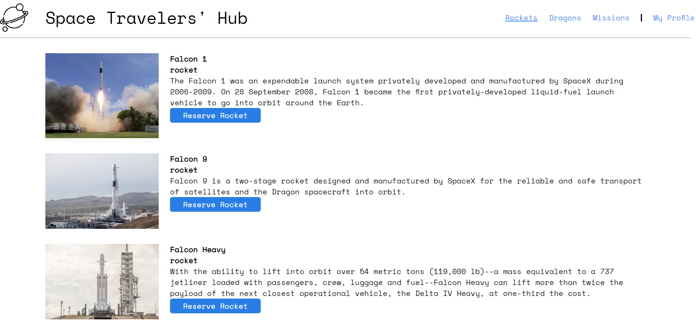

<a name="readme-top"></a>


<div align="center">

  <h1><b>Space Travelers' Hub</b></h1>
  

</div>

<!-- TABLE OF CONTENTS -->

# 📗 Table of Contents

- [📗 Table of Contents](#-table-of-contents)
- [📖 Space Travelers' Hub](#-space-travelers-hub)
  - [🛠 Built With ](#-built-with-)
    - [Tech Stack ](#tech-stack-)
    - [Key Features ](#key-features-)
  - [🚀 Live Demo ](#-live-demo-)
  - [💻 Getting Started ](#-getting-started-)
    - [Prerequisites](#prerequisites)
    - [Setup](#setup)
    - [Install](#install)
    - [Usage](#usage)
    - [Run tests](#run-tests)
    - [Deployment](#deployment)
  - [👥 Authors ](#-authors-)
  - [🔭 Future Features ](#-future-features-)
  - [🤝 Contributing ](#-contributing-)
  - [⭐️ Show your support ](#️-show-your-support-)
  - [🙏 Acknowledgments ](#-acknowledgments-)
  - [📝 License ](#-license-)

<!-- PROJECT DESCRIPTION -->

# 📖 Space Travelers' Hub<a name="about-project"></a>

The **Space Travelers' Hub** is a web application designed for a company offering commercial and scientific space travel services. Powered by React and Redux, this application enables users to book rockets, dragons, and participate in selected space missions.

By accessing the Space Travelers' Hub, users embark on an extraordinary adventure. They can explore various missions, rockets, and dragons, and customize their experience by making bookings according to their preferences.

This interactive application allows users to reserve the following:

 - 🚀 Dragons
 - 🚀 Rockets
 - 🚀🧑‍🚀👨‍🚀👩‍🚀 Space Missions

With its intuitive interface and comprehensive features, the Space Travelers' Hub opens the door to a world of exciting possibilities in space exploration.

## 🛠 Built With <a name="built-with"></a>

### Tech Stack <a name="tech-stack"></a>


<details>
  <summary>HTML</summary>
  <ul>
    <li>HTML</li>
  </ul>
</details>

<details>
  <summary>CSS</summary>
  <ul>
    <li>CSS</li>
  </ul>
</details>

<details>
  <summary>Javascript</summary>
  <ul>
    <li>Javascript</li>
  </ul>
</details>

<!-- Features -->

### Key Features <a name="key-features"></a>

- Use React documentation.
- Use React components.
- Use React props.
- Use React Router.
- Connect React and Redux.
- Handle events in a React app.
- Write unit tests with React Testing Library.
- Use styles in a React app.
- Use React hooks.
- Apply React best practices and language style guides in code.
- Use store, actions and reducers in React.
- Perform a code review for a team member.

<p align="right">(<a href="#readme-top">back to top</a>)</p>

<!-- LIVE DEMO -->

## 🚀 Live Demo <a name="live-demo"></a>

- Here is the [live demo version](https://space-hubs-travelers.onrender.com).

<p align="right">(<a href="#readme-top">back to top</a>)</p>

<!-- GETTING STARTED -->

## 💻 Getting Started <a name="getting-started"></a>

To get a local copy up and running, follow these steps:

 ```bash
 clone this repository into your machine
 npm start
```

### Prerequisites

In order to run this project you need:

- Create a repo on your repositores files.
- Clone or make a copy of this repo on your local machine.
- Follow GitHub flow.
- A carefully reading of this README.md is required.

### Setup

Clone this repository to your desired folder:
 
 ```bash
 cd my-folder
 git clone git@github.com:oovillagran/calculator-app.git
```

### Install

Install this project with:

 ```bash
 npm install
```

### Usage

To run the project, you can use your favorite browser.


### Run tests

To run tests, execute the following command:

```bash
 npm test
```

### Deployment

- N/A

<p align="right">(<a href="#readme-top">back to top</a>)</p>

<!-- AUTHORS -->

## 👥 Authors <a name="authors"></a>

👤 **Alhassan Osman**

- GitHub: [@flemton](https://github.com/flemton)
- Twitter: [@oalhassan847](https://twitter.com/oalhassan847)
- LinkedIn: [Alhassan Osman](https://www.linkedin.com/in/alhassan-o-83039a80/)
  
👤 **Larry Villegas**

- GitHub: [@LarryIVC](https://github.com/LarryIVC)
- Twitter: [@LarryVillegas](https://twitter.com/LarryVillegas)
- LinkedIn: [LinkedIn](https://www.linkedin.com/in/larry-villegas-26216b259/)

👤 **Oscar Villagran**

- GitHub: [@oovillagran](https://github.com/oovillagran)
- Twitter: [@oovillagran](https://twitter.com/oovillagran)
- LinkedIn: [Oscar Villagran](https://www.linkedin.com/in/oovillagran/)

<p align="right">(<a href="#readme-top">back to top</a>)</p>

<!-- FUTURE FEATURES -->

## 🔭 Future Features <a name="future-features"></a>


- [ ] **User Logging.**
- [ ] **User Authentication**


<p align="right">(<a href="#readme-top">back to top</a>)</p>

<!-- CONTRIBUTING -->

## 🤝 Contributing <a name="contributing"></a>

Contributions, issues, and feature requests are welcome!

Feel free to check the [issues page](../../issues/).

<p align="right">(<a href="#readme-top">back to top</a>)</p>

<!-- SUPPORT -->

## ⭐️ Show your support <a name="support"></a>

If you like this project feel free to make any comment, all contributions are welcome!.

<p align="right">(<a href="#readme-top">back to top</a>)</p>

<!-- ACKNOWLEDGEMENTS -->

## 🙏 Acknowledgments <a name="acknowledgements"></a>

We would like to thank Microverse comunity. We thank our learning, morning session and standup partners for supporting us.

<p align="right">(<a href="#readme-top">back to top</a>)</p>

## 📝 License <a name="license"></a>

This project is [MIT](LICENSE.md) licensed.

<a href="LICENSE.md">

<p align="right">(<a href="#readme-top">back to top</a>)</p>
